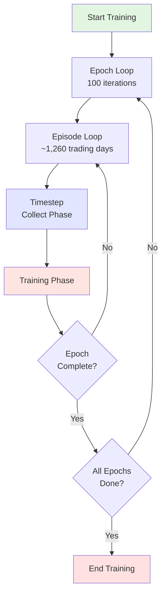
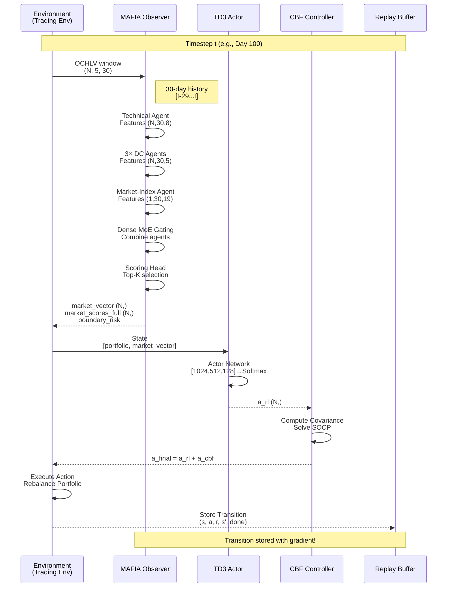
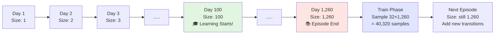
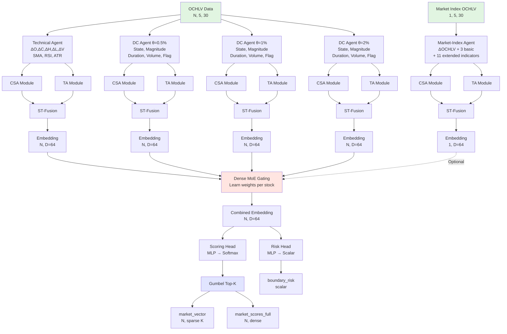
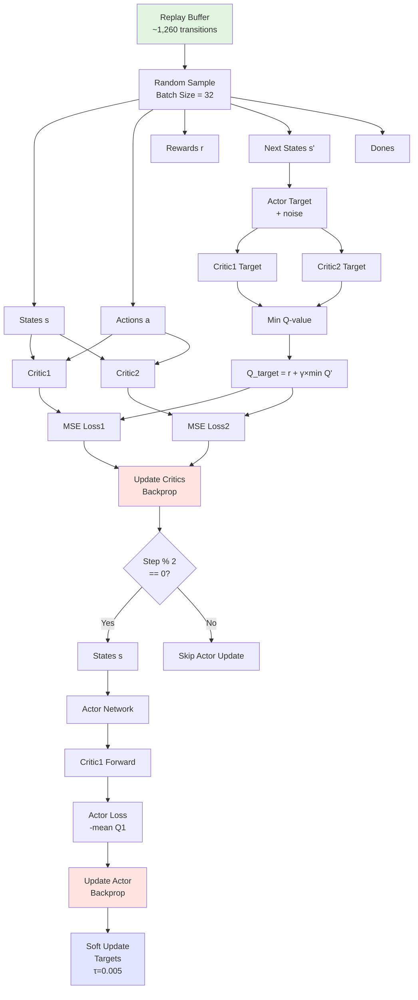
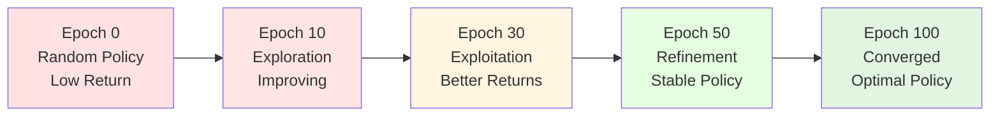
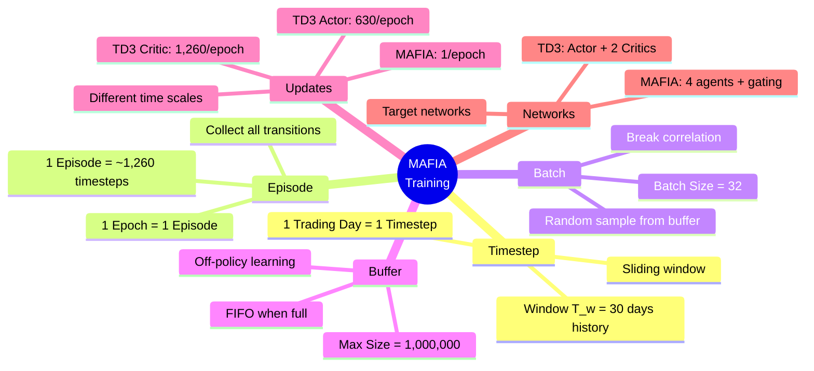
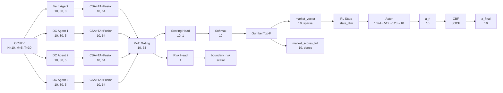
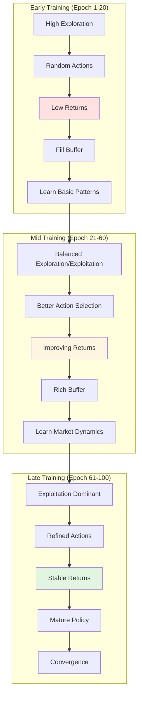

# MAFIA Training Flow - Visual Diagrams

## 📊 Overview: High-Level Architecture



---

## 🔄 Single Timestep Detailed Flow



---

## 🎓 Training Phase - After Episode

```mermaid
flowchart TD
    A[Episode Complete<br/>1,260 transitions collected] --> B{Buffer Size<br/> ≥ 100?}
    B -->|No| Z[Skip Training<br/>Continue Collecting]
    B -->|Yes| C[Start Training Phase]
    
    C --> D[TD3 Training Loop<br/>gradient_steps = 1,260]
    C --> E[MAFIA Training<br/>1 Policy Gradient Update]
    
    D --> D1[Sample Batch 32<br/>from Buffer]
    D1 --> D2[Update Critic<br/>MSE Loss]
    D2 --> D3{Step % 2 == 0?}
    D3 -->|Yes| D4[Update Actor<br/>Policy Gradient<br/>Soft Update Targets]
    D3 -->|No| D5[Skip Actor Update]
    D4 --> D6{More<br/>Steps?}
    D5 --> D6
    D6 -->|Yes| D1
    D6 -->|No| F[TD3 Complete<br/>1,260 Critic updates<br/>630 Actor updates]
    
    E --> E1[Compute Rewards<br/>from market_vectors]
    E1 --> E2[Policy Gradient Loss<br/>L = -mean(rewards)]
    E2 --> E3[Backprop through<br/>MAFIA model]
    E3 --> E4[Update All<br/>MAFIA Weights]
    E4 --> G[MAFIA Complete<br/>1 update]
    
    F --> H[Evaluation & Checkpoint]
    G --> H
    H --> I[Next Episode]
    
    style A fill:#e1f5e1
    style F fill:#ffe5e1
    style G fill:#ffe5e1
    style H fill:#e1e5ff
```

---

## 📊 Weight Update Timeline (1 Epoch)

```mermaid
gantt
    title Weight Update Schedule (1 Epoch = 1,260 Trading Days)
    dateFormat X
    axisFormat %s
    
    section Data Collection
    Collect 1,260 transitions :active, 0, 1260
    
    section TD3 Critic
    Update 1,260 times :crit, 1260, 1261
    
    section TD3 Actor
    Update 630 times :crit, 1260, 1261
    
    section MAFIA
    Update 1 time :milestone, 1260, 1261
    
    section Target Networks
    Soft update 630 times :1260, 1261
```



---

## 🔢 Replay Buffer Evolution



---

## 🎯 MAFIA Observer Architecture



---

## 🧠 TD3 Network Update Flow



---

## 📈 Learning Curve (Conceptual)



---

## 🎯 Key Concepts Summary



---

## 🔍 Detailed Dimensions Flow



---

## 📊 Training Stats Example

After 1 Epoch (hypothetical):

| Component | Updates | Time | Memory |
|-----------|---------|------|--------|
| **Data Collection** | 1,260 timesteps | ~5 min | Buffer: 10 MB |
| **TD3 Critic** | 1,260 updates | ~3 min | Batch: 32 samples |
| **TD3 Actor** | 630 updates | ~1.5 min | Batch: 32 samples |
| **MAFIA Observer** | 1 update | ~0.5 min | Episode: 1,260 samples |
| **Evaluation** | Valid + Test | ~2 min | Full episodes |
| **Total** | - | ~12 min | ~20 MB |

**Scalability for 100 Epochs:**
- Total time: ~20 hours
- Total TD3 Critic updates: 126,000
- Total TD3 Actor updates: 63,000
- Total MAFIA updates: 100
- Buffer max size: ~100 MB (at full capacity)

---

## 🎓 Learning Dynamics



---

## 💡 Quick Reference

### Time Concepts
- **1 Epoch** = 1 Episode = ~1,260 Trading Days
- **1 Timestep** = 1 Trading Day
- **100 Epochs** = 100 Episodes = ~126,000 Timesteps

### Space Concepts
- **Window Size (T_w)** = 30 days of history
- **Batch Size** = 32 samples per gradient update
- **Buffer Size** = 1,000,000 max transitions

### Update Frequencies (per Epoch)
- **TD3 Critic**: 1,260 updates
- **TD3 Actor**: 630 updates (every 2 steps)
- **MAFIA**: 1 update (end of episode)

### Key Dimensions
- **N** = 10 (number of stocks)
- **M** = 5 (OCHLV features)
- **T_w** = 30 (window size)
- **D** = 64 (embedding dimension)
- **K** = 10 (Top-K selection)

---

**Note**: All diagrams can be rendered in any Markdown viewer that supports Mermaid (e.g., GitHub, VS Code with extensions, Obsidian, etc.)

---

**Để view diagrams này:**
1. Open trong GitHub (auto-render Mermaid)
2. Dùng VS Code với extension "Markdown Preview Mermaid Support"
3. Copy vào Obsidian
4. Dùng online tool: https://mermaid.live/

